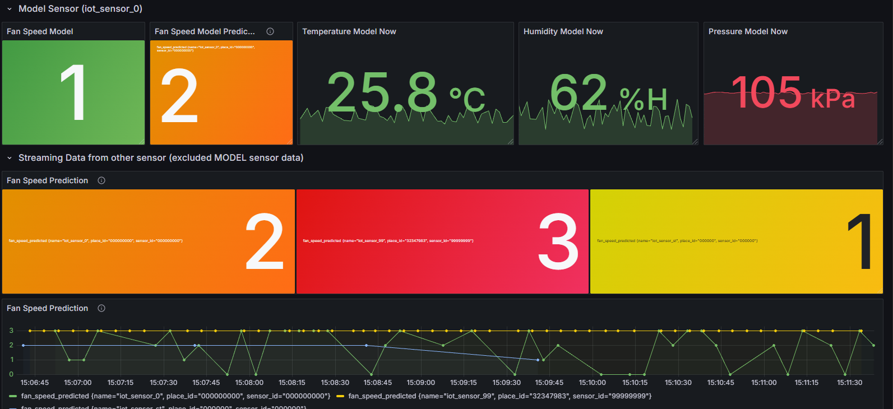

# Online Prediction

<!-- Online Prection ทำงานอย่างไร  -->
เชื่อมต่อกับ Kafka broker
ข้อความจาก input topic
โหลดโมเดลจากไฟล์ (fan_speed_model.pkl)
ทำนาย fan_speed_predicted
เก็บ metric (Accuracy, MAE) แบบ online
สร้าง JSON ใหม่ส่งไปที่ Kafka output topic (fan-speed-prediction)
เขียนผลการทำนาย (prediction) ลง InfluxDB เพื่อใช้ Dashboard

## ปิดการใช้งานของ Batch ML ดังนี้

1. Kafka-to-Jsonl
2. Train-from-data
3. Predict-then-influxdb

## เริ่มใช้งาน Online ML ดังนี้

1. docker compose down Batch ML
2. แก้ไขไฟล์ .env ของ Online ML
3. docker compose up Online ML

## ผลที่ได้จากการใช้ ML มีดังนี้

<!-- แนบรูป Grafana  พร้อมอธิบาย -->
